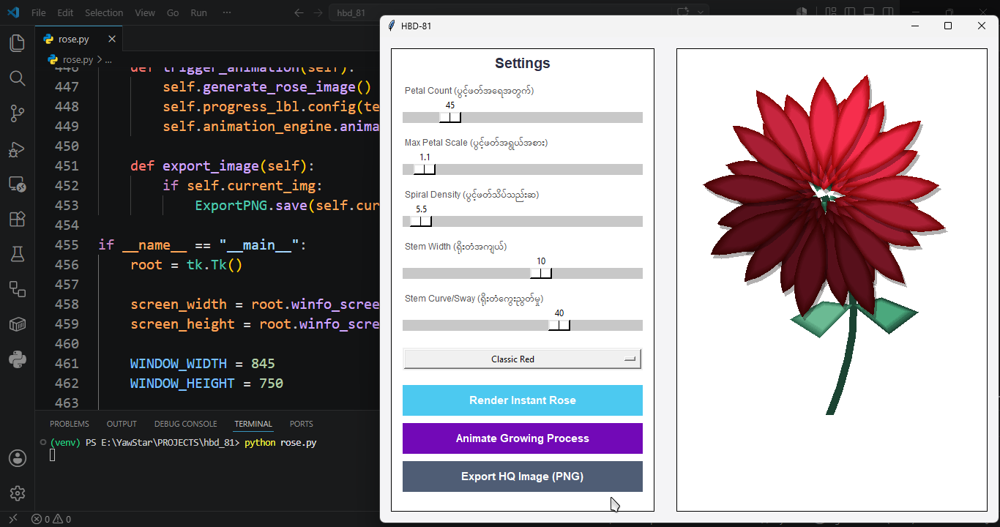

# HBD-81: Spiral Rose Generator 🌹

A Python Tkinter application created to commemorate the **81st Birthday of Daw Aung San Suu Kyi**. This project procedurally generates elegant rose graphics using mathematical spiral formulas and Bézier curves, providing an interactive GUI to customize the bloom's appearance and animate its growth process.

ဒေါ်အောင်ဆန်းစုကြည်၏ **(၈၁) နှစ်မြောက် မွေးနေ့အထိမ်းအမှတ်**အဖြစ် ရည်စူး၍ ရေးဆွဲထားသော နှင်းဆီပန်း ဂျင်နရေတာ (Python Tkinter) ပရိုဂရမ် ဖြစ်ပါသည်။ ဤပရိုဂရမ်သည် သင်္ချာနည်းကျ စပိုင်ရယ်ပုံသေနည်းများ (Spiral Formula) နှင့် ဘီဇီယာကွေးညွတ်မှုများ (Bézier Curves) ကို အသုံးပြုကာ လှပဆန်းသစ်သော နှင်းဆီပန်းပုံရိပ်များကို စနစ်တကျ ဖန်တီးပေးပြီး ပန်းပွင့်လာပုံ အဆင့်ဆင့်ကို Animation ဖြင့် ကြည့်ရှုနိုင်စေရန် ဖန်တီးထားပါသည်။

---

## 📸 Application Screenshot



---

## 🌟 Features (လုပ်ဆောင်ချက်များ)

- **Procedural Generation (စနစ်တကျ ပုံဖော်ခြင်း):** Generates lifelike roses using Fermat's Spiral and Cubic Bézier curves for petals.
- **Interactive Controls (စိတ်ကြိုက် ပြင်ဆင်နိုင်မှု):** Fine-tune petal count, max scale, spiral density, stem width, and stem sway via slider controls.
- **Color Presets (အရောင်အမျိုးမျိုး ရွေးချယ်နိုင်ခြင်း):** Choose between Classic Red, Deep Crimson, Sunset Orange, Soft Pink, and Mystic Purple.
- **Growth Animation (ကြီးထွားမှု အန်နီမေးရှင်း):** Watch the rose bloom dynamically with the "Animate Growing Process" feature.
- **HQ Image Export (အရည်အသွေးမြင့် ပုံထုတ်ယူခြင်း):** Save your customized rose creations as high-quality PNG files.

---

## 🛠️ Built With (အသုံးပြုထားသော နည်းပညာများ)

- **Python 3**
- **Tkinter** (For Graphical User Interface)
- **Pillow (PIL)** (For advanced image processing, gradients, lighting, and shadow rendering)

---

## 🚀 Getting Started (စတင်အသုံးပြုပုံ)

### Prerequisites (လိုအပ်ချက်များ)
Ensure you have Python installed on your system. You will need to install the `Pillow` library for image processing.

ပရိုဂရမ်ကို run ရန် သင့်စက်တွင် Python တင်ထားရပါမည်။ ထို့ပြင် ပုံရိပ်စီမံရန်အတွက် `Pillow` library ကို အောက်ပါအတိုင်း Install လုပ်ပေးရန် လိုအပ်ပါသည်။

```bash
pip install Pillow
